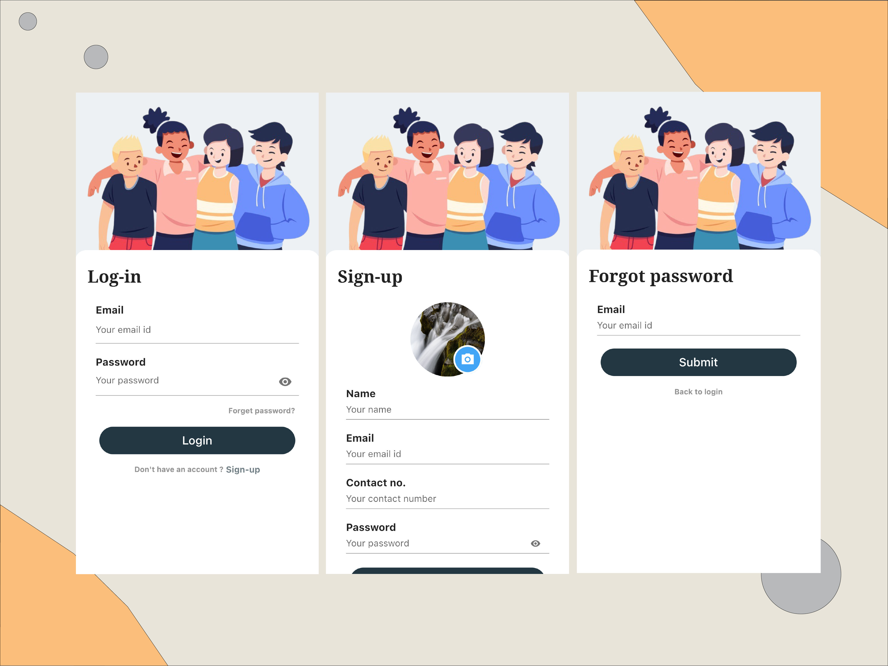

# Login And Sign-up Screens - Flutter UI

This project is an implementation of a Design i found on [dribbble.com](https://dribbble.com/shots/15145502-Login-And-Sign-up-Screens) by [Yashvi Bhatt](https://dribbble.com/YashviBhatt)

## Art

<br>

## App UI


## Getting Started

This project is a starting point for a Flutter application.

To clone this project, open your terminal or cmd

```
cd folder/to/clone-into/
```

```
git clone https://github.com/madeeldev/flutter-simple-login-signup.git
```

Then locate the project on your system and open with android studio or Vscode or intellij IDE.

To Run:
```
C:\path\to\project> flutter pub get

```
then run:

```
C:\path\to\project> flutter run

```

## Build release version

```
run: flutter build <OS PLATFORM> e.g flutter build ios
```

## Resources

A few resources to get you started if this is your first Flutter project:

- [Lab: Write your first Flutter app](https://flutter.io/docs/get-started/codelab)
- [Cookbook: Useful Flutter samples](https://flutter.io/docs/cookbook)

For help getting started with Flutter, view our
[online documentation](https://flutter.io/docs), which offers tutorials,
samples, guidance on mobile development, and a full API reference.

## Prerequisites

What things you need to run the app

```
* Android Studio/Vscode/Intellij IDE
* Flutter SDK
* Android SDK
* Windows/MacBook
```

## How to contribute

- **Fork the repository and clone it locally**. Connect your local to the original “upstream” repository by adding it as a remote. Pull in changes from “upstream” often so that you stay up to date so that when you submit your pull request, merge conflicts will be less likely. (See more detailed instructions here.)
- **Create a branch** for your edits.
- **Reference any relevant issues** or supporting documentation in your PR (for example, “Closes #37.”)
- **Include screenshots of the before and after** if your changes include differences in HTML/CSS. Drag and drop the images into the body of your pull request.
- **Test your changes!** Run your changes against any existing tests if they exist and create new ones when needed. Whether tests exist or not, make sure your changes don’t break the existing project.
- **Contribute in the style of the project** to the best of your abilities. This may mean using indents, semi-colons or comments differently than you would in your own repository, but makes it easier for the maintainer to merge, others to understand and maintain in the future.

## Built With

- [Android Studio](https://developer.android.com/studio/install) - How to install Android Studio
- [Flutter](https://flutter.io) - Flutter Official website

## Author 😊

**Adeel Safdar**

- [**Linkedin**](https://www.linkedin.com/in/madeeldev/)

## Inspiration

**Yashvi Bhatt**

- [**https://dribbble.com/YashviBhatt**](https://dribbble.com/shots/15145502-Login-And-Sign-up-Screens)
